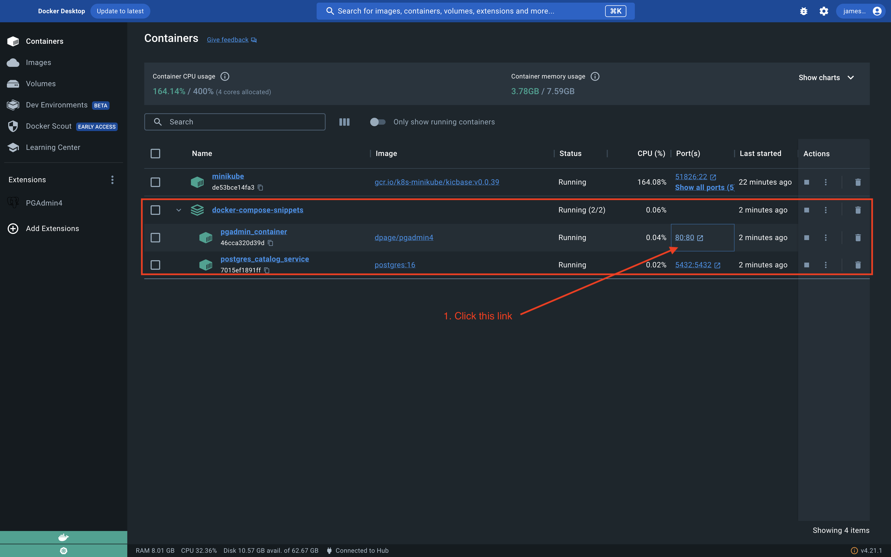
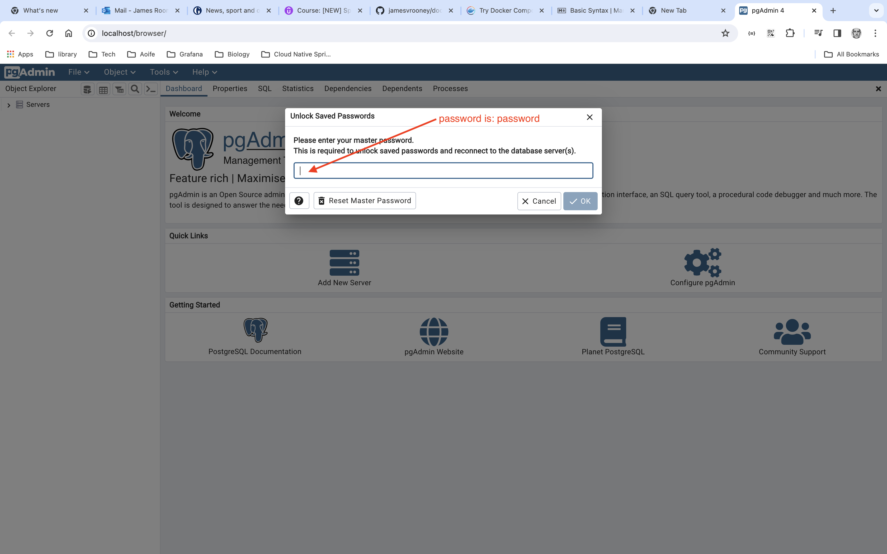
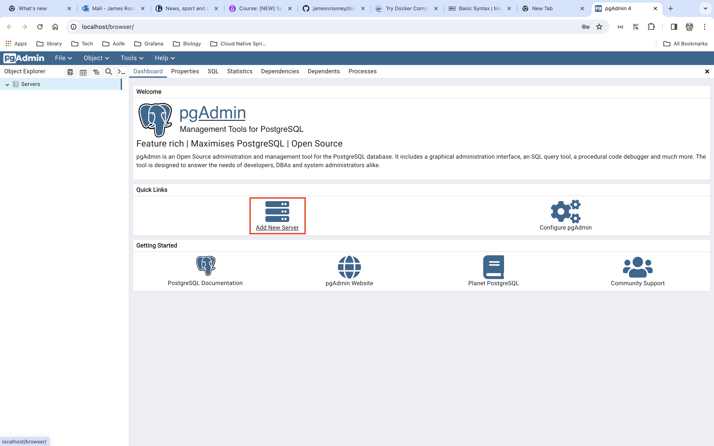
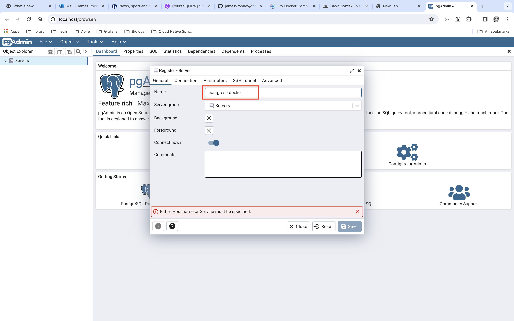
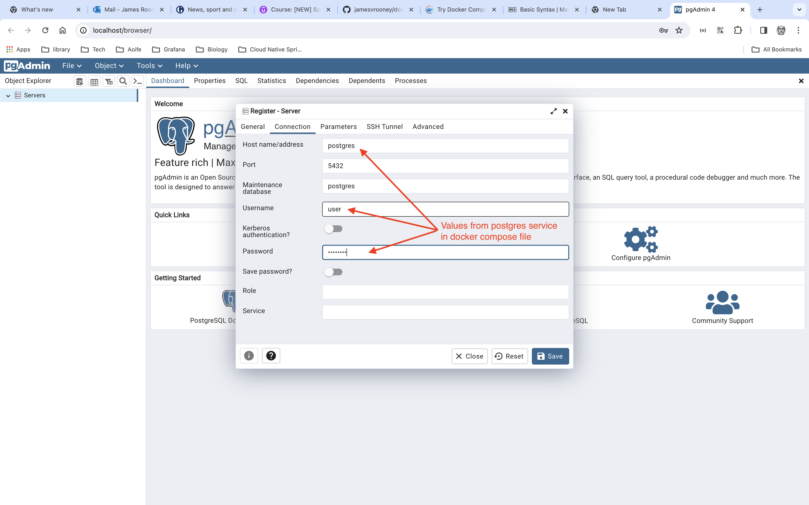
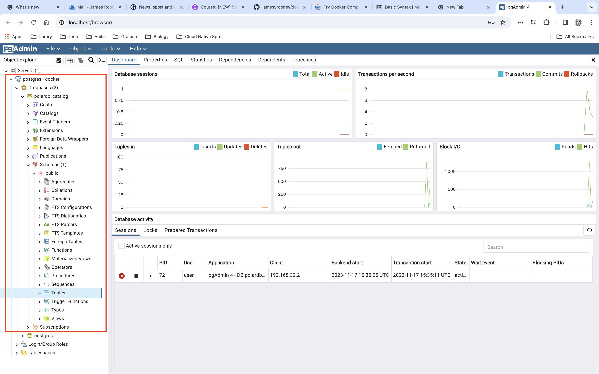

# docker compose snippets

## Contents
1. [docker-compose-postgres-pgadmin](#docker-compose-postgres-pgadmin)
2. [Something else](#something-else)

### <a id="docker-compose-postgres-pgadmin"></a> Run docker-compose-postgres-pgadmin.yml

### Start
```
docker compose -f docker-compose-postgres-pgadmin.yml up -d
```
or rename file to: **docker-compose.yml**

```
docker compose up -d
```
### Stop
```
docker compose -f docker-compose-postgres-pgadmin.yml down
```
or if file is called: **docker-compose.yml**

```
docker compose down
```
#### View running containers in Docker Desktop


#### Enter the master password for PGAdmin


#### Add new server


#### Set new server name


#### Connect to postgres running in docker container


#### Connected


---

### <a id="something-else"></a> Something else